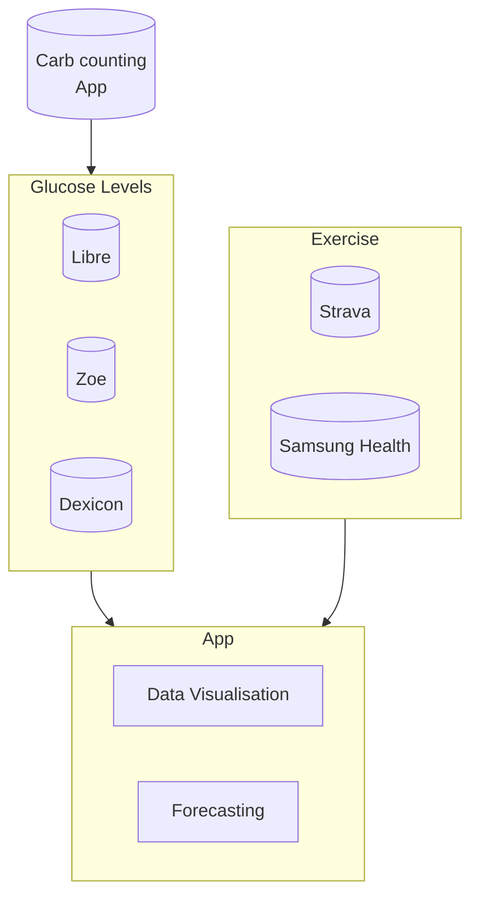

# README

The purpose of this app is to:

* Represent glucose levels and exercise activities in one place
* Identify patterns, indicators of high/low glucose events
* Use machine learning to suggest food/insulin intake

## Outline

An oversimplified outline of what this app will try to achieve.



## Libre
Accessing the libre data via an api directly is not possible (at least its not well documented).
Instead we use a `connected app` `Libre LinkUp` to access the data.
This app is usually to allow other family members to see your glucose levels in case help is required.
The caveat is, the amount of data stored is presumably limited (1 week), so a csv import is still required for historic data, and the service needs to be continually polled.

### Setup `Libre Linkup`
* Download the `Libre Linkup` from your app store
* Create an account, or use your existing `LibreView` login credentials.
* On the libre app used to scan the sensor, click connected apps and enter the details.
* Accept the link on `Libre Linkup` app.

## Strava

## Executing the tasks

```sh
./build_all.sh
./run.sh
```

### Tests

```sh
./build_all.sh
./run_tests.sh
```

### Database
A Postgres database to store that glucose records.