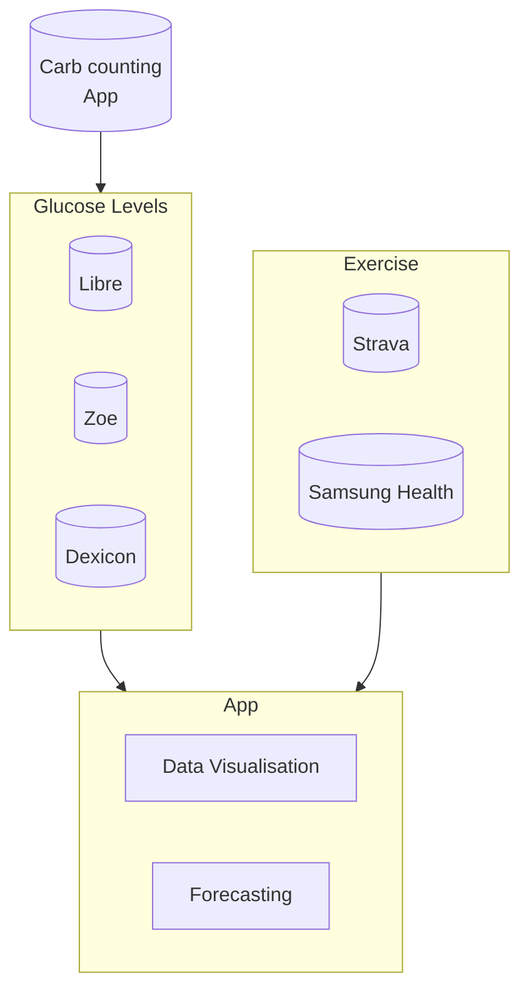

# README

The purpose of this app is to:

* Represent glucose levels and exercise activities in one place
* Identify patterns, indicators of high/low glucose events
* Use machine learning to suggest food/insulin intake

## Outline

An oversimplified outline of what this app will try to achieve.

